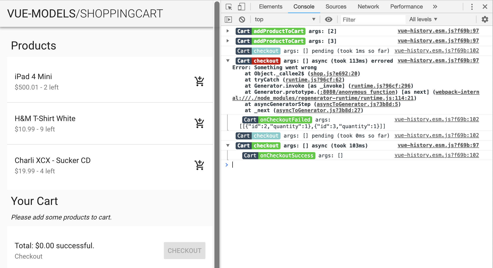

[](https://circleci.com/gh/sumcumo/vue-history)
[](https://codeclimate.com/github/sumcumo/vue-history/maintainability)
[](https://codeclimate.com/github/sumcumo/vue-history/test_coverage)
[](https://depfu.com/github/sumcumo/vue-history?project_id=7632)

# Vue History

The purpose of Vue History is to keep track of what's happening inside Vue components. It logs all method calls and keeps track of **nested method calls, errors, asynchronous processes and timings**.

The plugin was created alongside [Vue States](https://github.com/sumcumo/vue-states), but can be applied to any Vue component.

Checkout the examples at https://github.com/JohannesLamberts/vue-states-examples.



Whats displayed in the screenshot is Vue History in action with an instant feed to the console.

- the status of each call: `pending | doneOk | doneErrored`
- nested calls: `onCheckoutSuccess` beeing called by `checkout`
- arguments: `addProductToCart args: [3]` 
- timings: `checkout` taking about 100ms
- errors: `checkout` causing an exception with the message `'Something went wrong'`

## Install

```javascript
import VueHistory from '@sum.cumo/vue-history'

Vue.use(VueHistory, {
  // in strict mode, Vue History will watch for untracked data-changes
  // you might want to disable this expensive process in production
  strict: process.env.NODE_ENV === 'development', // default: true
})
```

Apart from strict mode there are a few more options:

```typescript
export interface HistoryInstallOptions {
  strict?: boolean,                         // watch for untracked data-changes
  filter?: (event: Event) => boolean,       // filter events before they are written to the history
  onEvent?: (event: Event) => void,         // react to incoming events
  feed?: boolean | { asyncStart: boolean }, // write a live feed to the console (default: false, asyncStart defaults to true)
}
```

## Apply

After installation, tracking can be activated on any component like this:

```javascript
export default {
  history: true,
}
```

## Print

Vue History adds a `$globalHistory` property onto every component. 
You can use this to get a reference to the GlobalHistory.

```javascript
const app = new Vue({ el: '#app' })
window.__VUE_HISTORY__ = app.$globalHistory
```

The GlobalHistory and the local ComponentHistory expose the same interface.

```javascript
__VUE_HISTORY__.print()
// accessing a components history via the $history property
$vm0.$history.print()
```

The print can be customized:

```typescript
interface PrintOptions {
  time: boolean,          // show time of the method call (default: false)
  collapse: boolean,      // use console.groupCollapsed (default: true)
  hierarchical: boolean,  // show nested structure (default: true), will be flattened if false
}
```

## Rules

There are actually just two rules you must follow to pass the strict mode.
Violations will be logged like this: 


### Methods

The components data may only be changed through its `methods`. 
No double-data bindings, no direct changes from outside the component.

### Synchronous changes

All data changes must be applied in the synchronous part of the component.

```javascript
import api from 'awesome-api'
export default {
  data() { 
    return { 
      apiCalls: 0,
      data: null 
    } 
  },
  methods: {
    async loadDataGood() {
      // valid
      this.apiCalls += 1
      // good
      this.saveData(await api.loadData())
    },
    async loadDataBad() {
      // valid so far
      this.apiCalls += 1
      // bad - the history couldn't show at what time 'data' was mutated
      this.data = await api.loadData()
    },
    saveData(data) {
      this.data = data
    },  
  },
}

```

## Goodies

### Watch for forgotten awaits

You can use `onEvent` to watch for events that resolved, before all the other asynchronous methods they called resolved as well.

```javascript
Vue.use(VueHistory, {
  onEvent: (callEvent) => {
    // look for methods beeing finished before they fired all sub-methods
    if (callEvent.caller && callEvent.caller.done) {
      console.warn(
        `Method was called after parent method did already finish. Did you forget to await for setTimeout()?`,
        { event: callEvent },
      )
    }
    // look for methods beeing finished before all fired sub-methods where finished as well
    callEvent.promise
      .then(() => {
        // search for unresolved subEvents
        const pending = callEvent.subEvents.filter(e => !e.done)
        if (pending.length) {
          console.warn(
            `Method resolved with ${pending.length} unfinished nested calls. Did you forget to await?`,
            { event: callEvent, pending },
          )
        }
      })
  },
})
```  

## License

Copyright 2019 [sum.cumo GmbH](https://www.sumcumo.com/)

Licensed under the Apache License, Version 2.0 (the “License”); you may not use this file except in compliance with the License. You may obtain a copy of the License at

    http://www.apache.org/licenses/LICENSE-2.0

Unless required by applicable law or agreed to in writing, software distributed under the License is distributed on an “AS IS” BASIS, WITHOUT WARRANTIES OR CONDITIONS OF ANY KIND, either express or implied. See the License for the specific language governing permissions and limitations under the License.

----

[Learn more about sum.cumo](https://www.sumcumo.com/en/) or [work on open source projects](https://www.sumcumo.com/jobs/), too!
